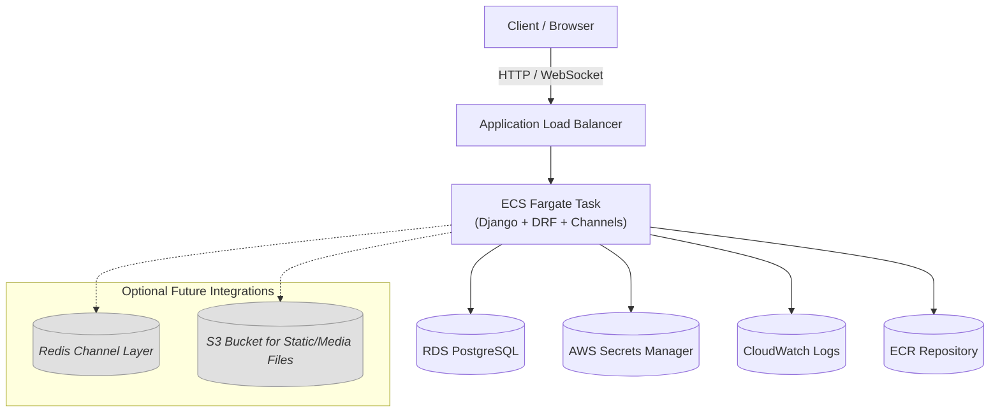

# System Architecture

This diagram shows the AWS infrastructure for the Django application with WebSocket support.

## Components

- **Client/Browser**: End users accessing the application
- **Application Load Balancer**: Routes HTTP and WebSocket traffic
- **ECS Fargate**: Containerized Django application with Django REST Framework and Channels
- **RDS PostgreSQL**: Primary database
- **AWS Secrets Manager**: Secure credential storage
- **CloudWatch Logs**: Centralized logging
- **ECR Repository**: Docker image storage

## Optional Components

- **Redis Channel Layer**: For scaling WebSocket connections across multiple containers
- **S3 Bucket**: For static and media file storage
